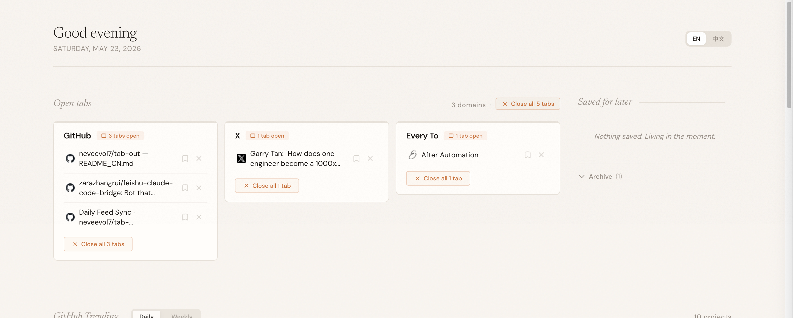

# Tab Out with Follow-Builders (中文版)

**管理您的标签页，时刻掌握 AI 领域的最新动向。**



Tab Out with Follow-Builders 是对原始 Tab Out 扩展的增强版本。它不仅能帮您理清凌乱的标签页，还能将 AI 世界的每日洞察直接推送到您的新标签页。

[English Version](./README.md)

---

## 🚀 最新功能 (New!)

### 🌍 全球化智能翻译

- **中英文一键切换**：支持全界面的中英文动态切换。默认根据浏览器语言自动选择，亦可手动点击右上角开关。
- **智能预翻译**：所有来自 GitHub Trending 和 Daily Feed 的英文内容都会通过后端自动翻译并预存。这意味着您可以秒开页面，无需等待翻译请求。
- **GitHub 全球实时趋势榜**：
  - **多维度切换**：支持 Daily（日榜）和 Weekly（周榜）一键切换。
  - **高密度信息展示**：精心设计的布局，展示项目描述、Star 增长及技术栈，且描述已汉化。

## 核心特性

- **每日 AI 资讯 (Daily Feed)**：专为 AI 开发者和研究者设计的资讯流，整合了顶级工程师博客和 𝕏 动态。
  - **智能日期分组**：自动展开“今天”的内容，收起历史动态，保持界面整洁。
  - **未读统计**：每个日期分组旁都有实时的（未读/总数）计数。
- **云端自动同步**：利用 GitHub Actions 每 2 小时自动抓取并翻译最新数据。
- **标签页管理**：
  - **网格视图**：按域名自动分组，一目了然。
  - **重复检测**：自动标记重复开启的页面，支持一键清理。
  - **稍后阅读**：关闭标签页前可将其收藏至侧边栏清单。

---

## 手动安装步骤

**1. 克隆仓库**

```bash
git clone https://github.com/neveevol7/tab-out.git
```

**2. 加载 Chrome 扩展**

1. 打开 Chrome，进入 `chrome://extensions`
2. 开启右上角的 **开发者模式** (Developer mode)。
3. 点击 **加载解压的扩展程序** (Load unpacked)。
4. 选择仓库中的 `extension/` 文件夹。

**3. 开启新标签页**

您将看到全新的 Tab Out 界面。

---

## 技术架构

| 组件 | 技术实现 |
|------|-----|
| 扩展程序 | Chrome Manifest V3 |
| 后端逻辑 | GitHub Actions + Python 同步与翻译脚本 |
| 翻译引擎 | deep-translator (Google API) |
| 数据存储 | JSON (托管于 GitHub，本地缓存至 chrome.storage) |

---

## 开源协议

MIT

---

由 [Zara](https://x.com/zarazhangrui) & [Neal](https://github.com/neveevol7) 联合打造
